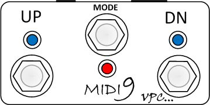
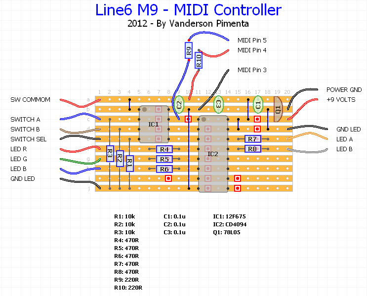

* [PIC Projects](#pic-projects)
* [Arduino Projects](#arduino-projects)

# PIC Projects
## MIDI Controller for Line6 M9 and M13 stompboxes

MIDI controller based on microntroller **PIC 12F675**. The source code was developed with [BoostC compiler](http://www.sourceboost.com/Products/BoostC/Overview.html).

This MIDI controller can control the follow function on the stompboxes:

1. Scenes up and down feature
2. Swicth between folders
3. Activate the pedal tuner
4. Control pedal loop features

Binary and source code can be found on the GitHub repository [here][1] [![alt text][1.1]][1]

[1]: http://www.github.com/vandersonpc/m9midi
[1.1]: http://i.imgur.com/0o48UoR.png (github icon with padding)

### Physical Proposal Layout

### Schematic Layout

### User's Manual

For more details check the user's manual [here](files/m9_midi_manual.pdf).

### License 

This project is supplied "AS IS" for individual use only. Comercial use is not authorized.  

# Arduino Projects
